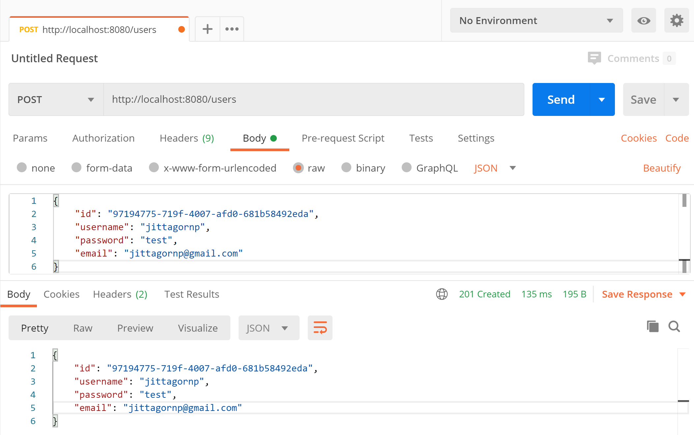

# spring-boot-reactive-controller

> ตัวอย่างการเขียน Spring-boot Reactive Controller 

# 1. เพิ่ม Dependencies และ Plugins

pom.xml 
``` xml
...
<parent>
    <groupId>org.springframework.boot</groupId>
    <artifactId>spring-boot-starter-parent</artifactId>
    <version>2.3.2.RELEASE</version>
</parent>

<dependencies>
    <dependency>
        <groupId>org.springframework.boot</groupId>
        <artifactId>spring-boot-starter-webflux</artifactId>
    </dependency>
    
    <dependency>
        <groupId>org.projectlombok</groupId>
        <artifactId>lombok</artifactId>
        <scope>provided</scope>
    </dependency>
</dependencies>

<build>
    <plugins>
        <plugin>
            <groupId>org.springframework.boot</groupId>
            <artifactId>spring-boot-maven-plugin</artifactId>
            <executions>        
                <execution>            
                    <id>build-info</id>            
                    <goals>                
                        <goal>build-info</goal>            
                    </goals>        
                    <configuration>                
                        <additionalProperties>                    
                            <java.version>${java.version}</java.version>                                   
                        </additionalProperties>            
                    </configuration>        
                </execution>    
            </executions>
        </plugin>
    </plugins>
</build>
...
```

หมายเหตุ lombox เป็น annotation code generator ตัวนึง

# 2. เขียน Main Class 

``` java
@SpringBootApplication
@ComponentScan(basePackages = {"me.jittagornp"})
public class AppStarter {

    public static void main(String[] args) {
        SpringApplication.run(AppStarter.class, args);
    }

}
```

# 3. เขียน Controller
``` java
@RestController
public class HomeController {
    ....
}

@Slf4j
@RestController
@RequestMapping("/users")
public class UserController {

    @GetMapping
    public Flux<User> findAll() {
        ...
    }

    @GetMapping("/{id}")
    public Mono<User> findById(@PathVariable("id") final String id) {
        ...
    }
    
    @PostMapping
    @ResponseStatus(HttpStatus.CREATED)
    public Mono<User> create(@RequestBody @Validated final User user){
        ...
    }
    
    @PutMapping("/{id}")
    public Mono<User> update(@PathVariable("id") final String id, @RequestBody @Validated final User user){
        ...
    }

    @DeleteMapping("/{id}")
    @ResponseStatus(HttpStatus.NO_CONTENT)
    public Mono<Void> deleteById(@PathVariable("id") final String id) {
        ...
    }

    @GetMapping("/me")
    public Mono<User> getUser() {
        ...
    }
}
```

### คำอธิบาย 

- `@RestController` เป็นการระบุว่า class นี้เป็น Controller แบบที่เป็น RESTFul
- `@RequestMapping("/users")` เป็นการกำหนด Path สำหรับทุก ๆ Method ใน Controller นี้ ว่าให้ขึ้นต้นด้วยคำว่า `/users`
- `@GetMapping`, `@PostMapping`, `@PutMapping`, `@DeleteMapping` เป็นการกำหนด Http Method + Path ที่ใช้ในการเข้าถึง 
- `@PathVariable("id")` เป็นการอ้างถึงค่าตัวแปรใน Path เช่น
    - `/users/{id}` => `/users/1` ดังนั้น id จึงเท่ากับ 1
- `@RequestBody` เป็นการแปลงและรับค่า request body จาก JSON => Java Object     
- `@ResponseStatus` หลังจากประมวลผลเสร็จแล้ว ถ้า Success จะให้ Http Response Status เป็นอะไร เช่น 
   - 201 : CRATED
   - 204 : NO_CONTENT เป็นต้น 
   - ซึ่งถ้าไม่ใส่ default จะเป็น 200 : OK 


# 4. Build Code
cd ไปที่ root ของ project จากนั้น  
``` shell 
$ mvn clean package
```

# 5. Run 
``` shell 
$ mvn spring-boot:run
```

# 6. เข้าใช้งาน

เปิด browser หรือ Postman แล้วเข้า 

- [http://localhost:8080](http://localhost:8080)
- [http://localhost:8080/days](http://localhost:8080/days)
- [http://localhost:8080/months](http://localhost:8080/months)
- [http://localhost:8080/users](http://localhost:8080/users)
- [http://localhost:8080/users/1](http://localhost:8080/users/1)
- [http://localhost:8080/users/me](http://localhost:8080/users/me)


