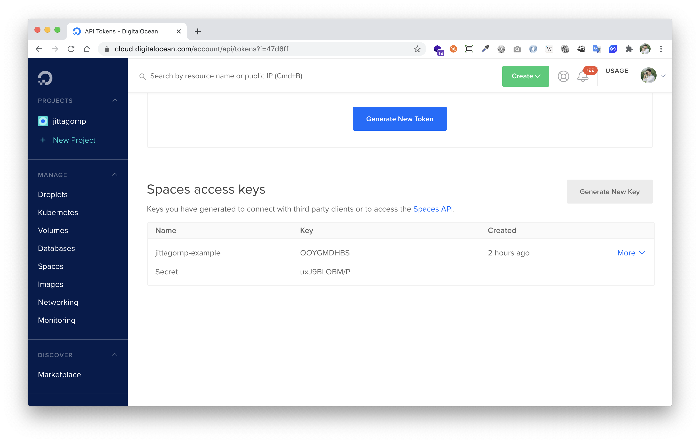
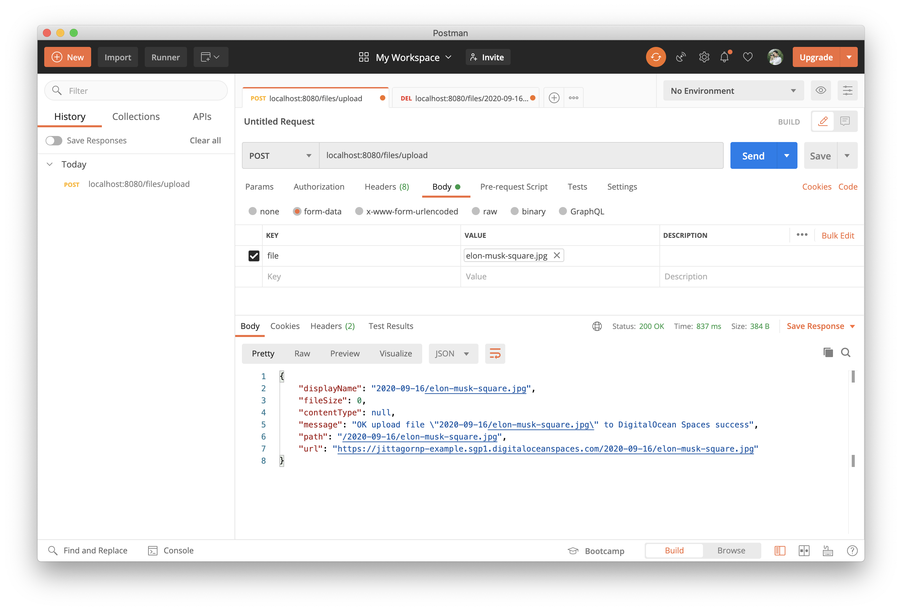
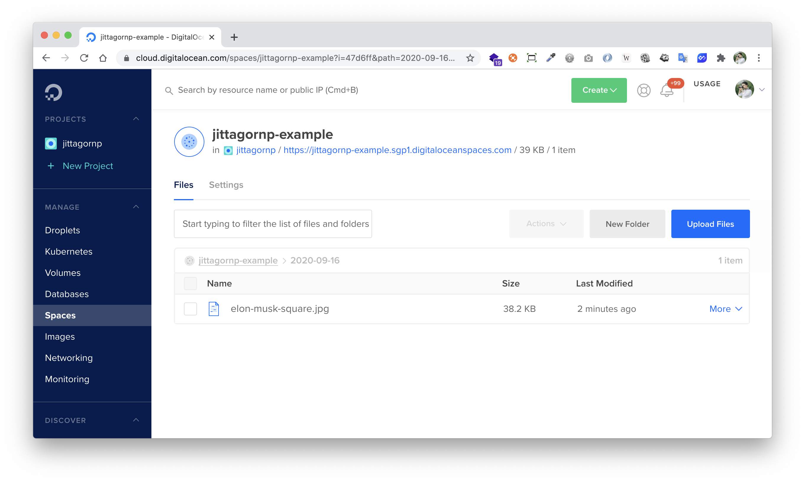
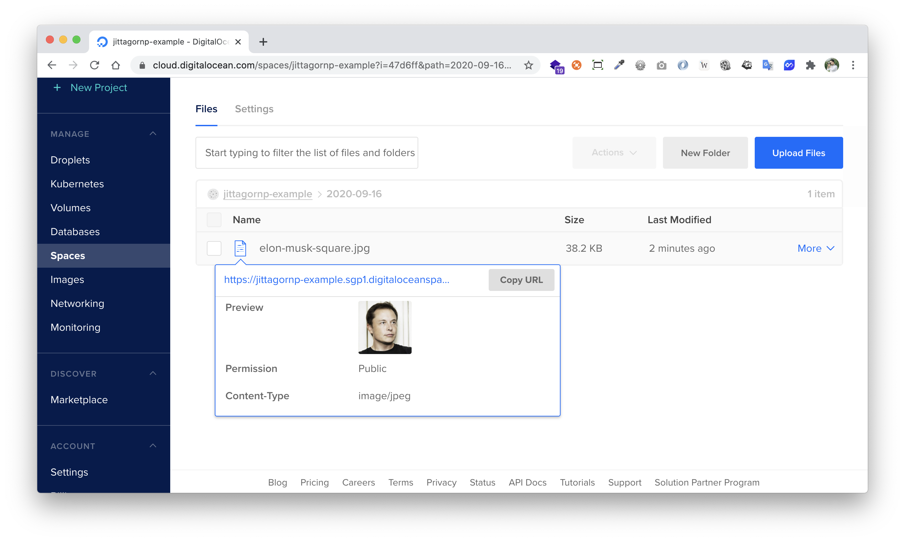
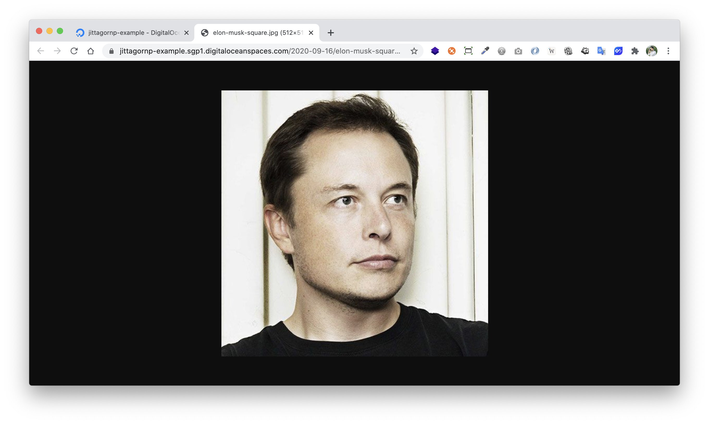
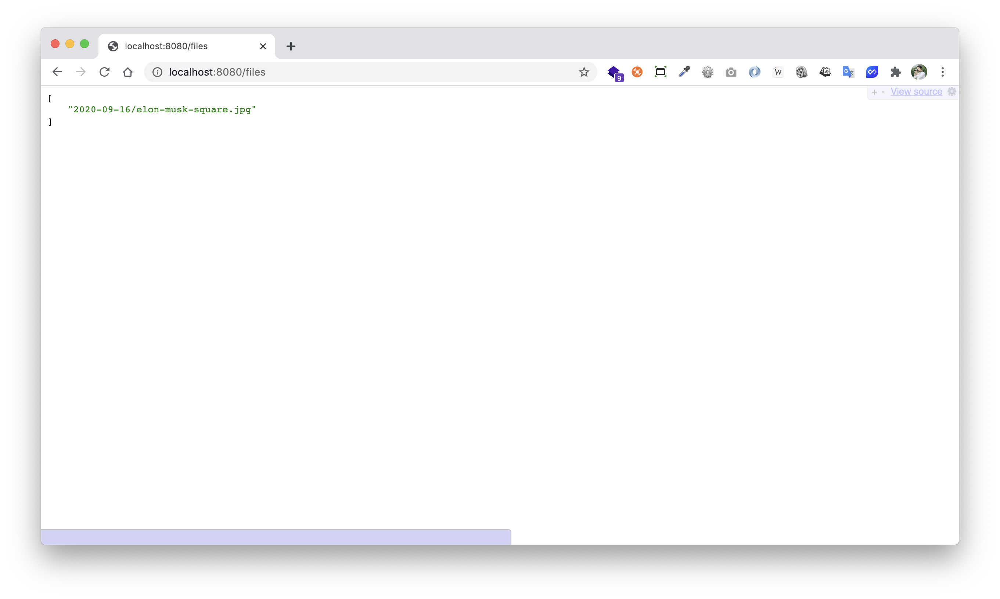
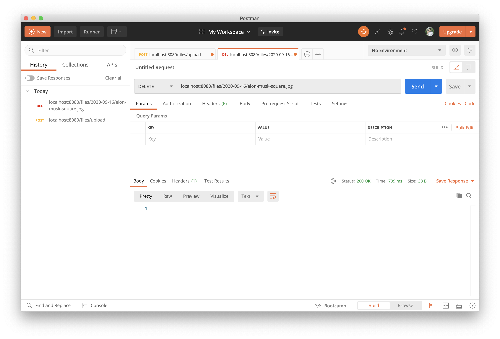

# spring-boot-reactive-digitalocean-spaces

> ตัวอย่างการเขียน Spring-boot Reactive เชื่อมต่อกับ DigitalOcean Spaces

# Prerequisites

- สร้าง DigitalOcean Spaces
   - กำหนด Region ว่าจะให้เก็บไฟล์ไว้ที่ไหน เช่น อเมริกา สิงคโปร์ ฯลฯ เป็นต้น
   - ตั้งชื่อ Space หรือ Bucket Name 
   - Config ค่าอื่น ๆ เพิ่มเติม เช่น การใช้งาน CDN เป็นต้น
   


- สร้าง Access Key สำหรับเข้าใช้งาน Spaces
   - ซึ่งเราจะได้ Key กับ Secret (ที่เปรียบเสมือนกับ Username/Password) มาใช้งาน
   
   

จากนั้นมาเขียน Code กัน

# 1. เพิ่ม Dependencies และ Plugins

pom.xml

```xml
...
<parent>
    <groupId>org.springframework.boot</groupId>
    <artifactId>spring-boot-starter-parent</artifactId>
    <version>2.3.3.RELEASE</version>
</parent>

<dependencies>
    <dependency>
        <groupId>org.springframework.boot</groupId>
        <artifactId>spring-boot-starter-webflux</artifactId>
    </dependency>

    <dependency>
        <groupId>org.projectlombok</groupId>
        <artifactId>lombok</artifactId>
        <scope>provided</scope>
    </dependency>

    <dependency>
        <groupId>com.amazonaws</groupId>
        <artifactId>aws-java-sdk-core</artifactId>
        <version>1.11.857</version>
    </dependency>

    <dependency>
        <groupId>com.amazonaws</groupId>
        <artifactId>aws-java-sdk-s3</artifactId>
        <version>1.11.857</version>
    </dependency>
</dependencies>

<build>
    <plugins>
        <plugin>
            <groupId>org.springframework.boot</groupId>
            <artifactId>spring-boot-maven-plugin</artifactId>
            <executions>        
                <execution>            
                    <id>build-info</id>            
                    <goals>                
                        <goal>build-info</goal>            
                    </goals>        
                    <configuration>                
                        <additionalProperties>                    
                            <java.version>${java.version}</java.version>                                   
                        </additionalProperties>            
                    </configuration>        
                </execution>    
            </executions>
        </plugin>
    </plugins>
</build>
...
```
### หมายเหตุ

- `aws-java-sdk-core` และ `aws-java-sdk-s3` เป็น Dependencies หรือ SDK ของ Amazon S3 สามารถเอามาใช้เชื่อมต่อไปยัง DigitalOcean Spaces ได้ 

# 2. เขียน Main Class

```java
@SpringBootApplication
@ComponentScan(basePackages = {"me.jittagornp"})
public class AppStarter {

    public static void main(String[] args) {
        SpringApplication.run(AppStarter.class, args);
    }

}
``` 

# 3. กำหนด Config

ในตัวอย่างนี้ Config ไว้ใน Java Class ง่าย ๆ แบบนี้

```java
@Getter
@Component
public class DigitalOceanSpacesProperties {

    private String key = "E74A6FBDxxxxxxxxxx";

    private String secret = "NjkqulQURJ3TAHLxxxxxxxxxxxxxxxxxxxxxxxxxxxxxx";

    private String endpoint = "sgp1.digitaloceanspaces.com";

    private String region = "sgp1";

    private String bucketName = "jittagornp-example";
}
```

สามารถย้าย Config นี้ไปไว้ใน `application.properties` ได้
  
จากนั้นสร้าง Bean `AmazonS3` โดยใช้ Configuration จากด้านบน
```java
@Configuration
@RequiredArgsConstructor
public class DigitalOceanSpacesConfig {

    private final DigitalOceanSpacesProperties properties;

    @Bean
    public AmazonS3 getCredentials() {
        final BasicAWSCredentials credentials = new BasicAWSCredentials(properties.getKey(), properties.getSecret());
        final AWSStaticCredentialsProvider credentialsProvider = new AWSStaticCredentialsProvider(credentials);
        final AwsClientBuilder.EndpointConfiguration endpointConfiguration = new AwsClientBuilder.EndpointConfiguration(properties.getEndpoint(), properties.getRegion());
        return AmazonS3ClientBuilder.standard()
                .withEndpointConfiguration(endpointConfiguration)
                .withCredentials(credentialsProvider)
                .build();
    }

}
``` 

# 4. เขียน Service

เพื่อเชื่อมต่อไปยัง DigitalOcean Spaces 

### ประกาศ interface

```java
public interface FileService {

    Mono<List<String>> listAll();

    Mono<UploadResponse> upload(final InputStream inputStream, final String fileName);

    Mono<Void> deleteByPathFile(final String pathFile);

    @Data
    @Builder
    public static class UploadResponse {

        private String displayName;

        private Long fileSize;

        private String contentType;

        private String message;

        private String path;

        private String url;

    }

}
```

### Implement interface

```java
@Service
@RequiredArgsConstructor
public class FileServiceImpl implements FileService {

    private final DigitalOceanSpacesProperties properties;

    private final AmazonS3 amazonS3;

    @Override
    public Mono<List<String>> listAll() {
        return Mono.fromCallable(() -> {
            final ObjectListing objectListing = amazonS3.listObjects(properties.getBucketName());
            return objectListing.getObjectSummaries()
                    .stream()
                    .map(S3ObjectSummary::getKey)
                    .collect(toList());
        })
                .subscribeOn(Schedulers.elastic());
    }

    @Override
    public Mono<UploadResponse> upload(final InputStream inputStream, final String fileName) {
        return Mono.fromCallable(() -> {
            try {
                final String folder = LocalDate.now().format(DateTimeFormatter.ofPattern("yyyy-MM-dd"));
                final String key = folder + "/" + fileName;
                final ObjectMetadata metadata = new ObjectMetadata();
                metadata.setContentType(URLConnection.guessContentTypeFromName(fileName));
                final PutObjectRequest request = new PutObjectRequest(properties.getBucketName(), key, inputStream, metadata)
                        .withCannedAcl(CannedAccessControlList.PublicRead);
                final PutObjectResult result = amazonS3.putObject(request);
                return mapResponse(result, key);
            } finally {
                inputStream.close();
            }
        }).subscribeOn(Schedulers.elastic());
    }

    private UploadResponse mapResponse(final PutObjectResult result, final String key) {
        return UploadResponse.builder()
                .displayName(key)
                .contentType(result.getMetadata().getContentType())
                .fileSize(result.getMetadata().getContentLength())
                .message("OK upload file \"" + key + "\" to DigitalOcean Spaces success")
                .path("/" + key)
                .url(buildAccessUrl(key))
                .build();
    }

    private String buildAccessUrl(final String key) {
        return new StringBuilder()
                .append("https://")
                .append(properties.getBucketName())
                .append(".")
                .append(properties.getEndpoint())
                .append("/")
                .append(key)
                .toString();
    }

    @Override
    public Mono<Void> deleteByPathFile(final String pathFile) {
        return Mono.fromRunnable(() -> {
            final DeleteObjectRequest request = new DeleteObjectRequest(properties.getBucketName(), pathFile);
            amazonS3.deleteObject(request);
        }).subscribeOn(Schedulers.elastic()).then();
    }
}
```

Inject Bean `DigitalOceanSpacesProperties` และ `AmazonS3` มาใช้งาน

# 5. เขียน Controller 

เพื่อเรียกใช้งาน Service

```java
@RestController
@RequestMapping("/files")
@RequiredArgsConstructor
public class FileController {

    private final FileService fileService;

    @ResponseBody
    @GetMapping
    public Mono<List<String>> listAll() {
        return fileService.listAll();
    }

    @PostMapping(value = "/upload", consumes = MediaType.MULTIPART_FORM_DATA_VALUE)
    public Mono<FileService.UploadResponse> upload(@RequestPart("file") final FilePart filePart) {
        return DataBufferUtils.join(filePart.content())
                .map(dataBuffer -> dataBuffer.asInputStream())
                .flatMap(inputStream -> fileService.upload(inputStream, filePart.filename()));
    }

    @DeleteMapping("/{folder}/{fileName}")
    public Mono<Void> delete(
            @PathVariable("folder") final String folder,
            @PathVariable("fileName") final String fileName
    ) {
        return fileService.deleteByPathFile(folder + "/" + fileName);
    }

}
```

# 6. Build Code

cd ไปที่ root ของ project จากนั้น

```sh
$ mvn clean package
```

# 7. Run

```sh
$ mvn spring-boot:run
```

# 8. เข้าใช้งาน

เปิด browser แล้วเข้า [http://localhost:8080](http://localhost:8080)

# ทดสอบ

ลอง Upload File ผ่าน Postman



ตรวจสอบข้อมูลที่หน้า Bucket





ลองเข้าถึงข้อมูลจาก Browser



# หมายเหตุ
ที่เราสามารถเข้าถึง File แบบ Public ได้ เพราะตอน Upload File เรา Set Permission หรือ Access Control List (ACL) เป็น `CannedAccessControlList.PublicRead`

ลอง List File ทั้งหมดที่เคย Upload ไว้ดู



ลองลบ File ดู

 

