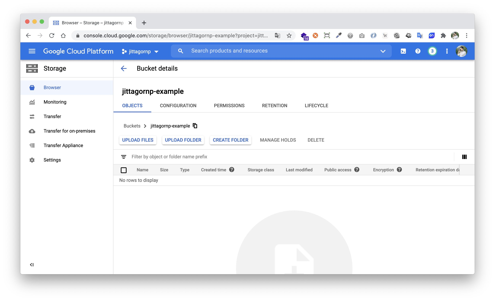
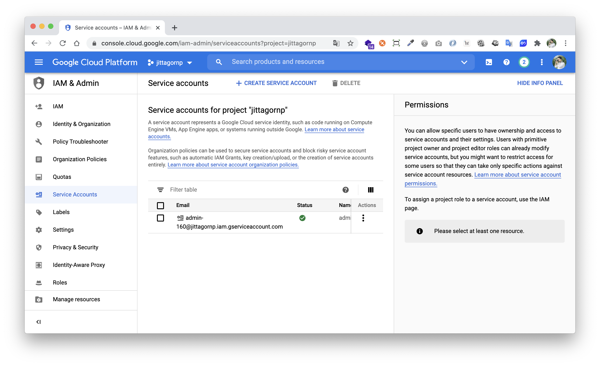
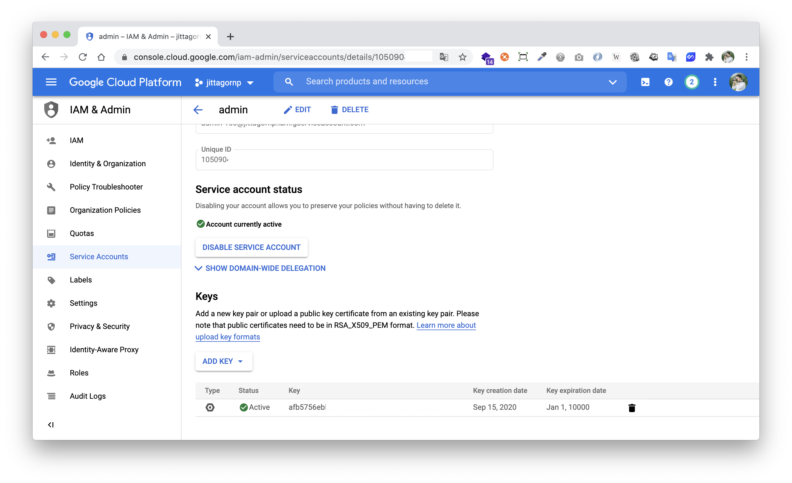
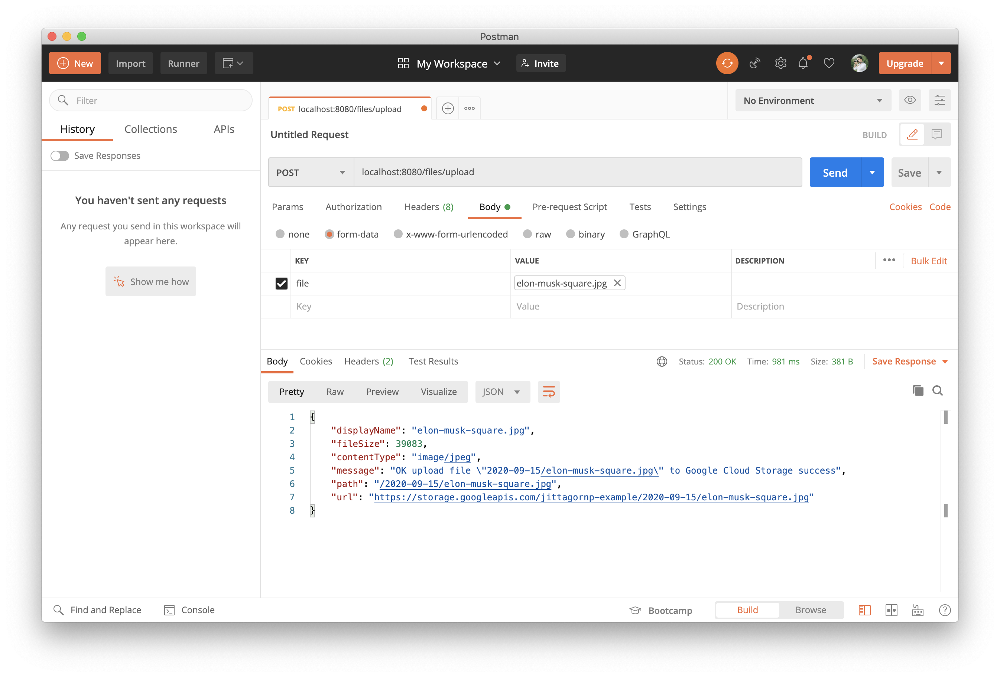
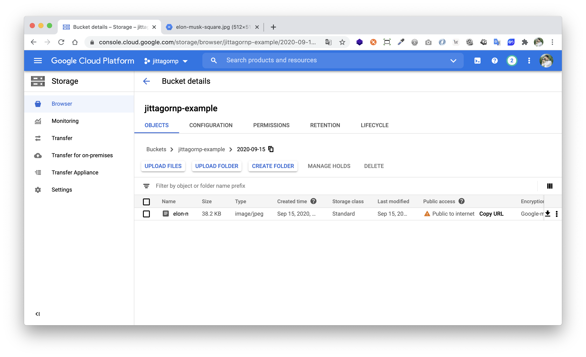
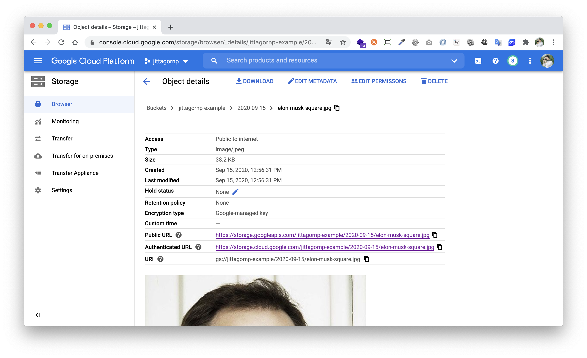
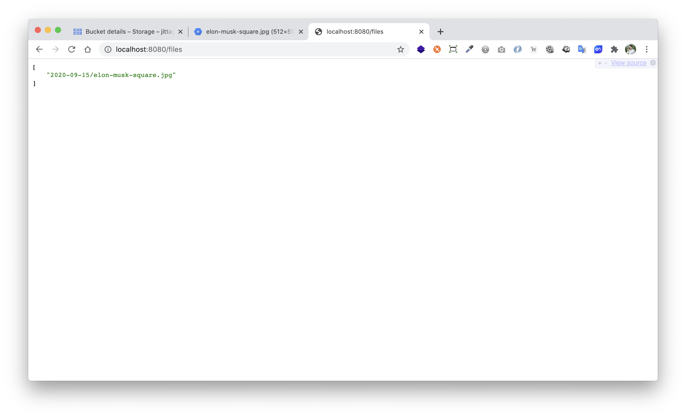

# spring-boot-reactive-google-cloud-storage

> ตัวอย่างการเขียน Spring-boot Reactive เชื่อมต่อกับ Google Cloud Storage

# Prerequisites

- สร้าง Google Project ที่หน้า Google Cloud Console [https://console.cloud.google.com/](https://console.cloud.google.com/)
- สร้าง Storage Bucket (ที่เก็บไฟล์ Upload)

 

- สร้าง Service Account + Key และ Export Key ในรูปแบบของ JSON

Service Account


Key 



จากนั้น Download Key เอามาไว้ใน Project (อาจจะเก็บไว้ใน Class path)   
จากนั้นก็มาเริ่มเขียน Code กัน 

# 1. เพิ่ม Dependencies และ Plugins 

pom.xml 
``` xml
...
<parent>
    <groupId>org.springframework.boot</groupId>
    <artifactId>spring-boot-starter-parent</artifactId>
    <version>2.3.3.RELEASE</version>
</parent>

<dependencyManagement>
    <dependencies>
        <dependency>
            <groupId>org.springframework.cloud</groupId>
            <artifactId>spring-cloud-gcp-dependencies</artifactId>
            <version>1.2.3.RELEASE</version>
            <type>pom</type>
            <scope>import</scope>
        </dependency>
    </dependencies>
</dependencyManagement>

<dependencies>
    <dependency>
        <groupId>org.springframework.boot</groupId>
        <artifactId>spring-boot-starter-webflux</artifactId>
    </dependency>

    <dependency>
        <groupId>org.projectlombok</groupId>
        <artifactId>lombok</artifactId>
        <scope>provided</scope>
    </dependency>

    <dependency>
        <groupId>org.springframework.cloud</groupId>
        <artifactId>spring-cloud-gcp-starter-storage</artifactId>
    </dependency>
</dependencies>

<build>
    <plugins>
        <plugin>
            <groupId>org.springframework.boot</groupId>
            <artifactId>spring-boot-maven-plugin</artifactId>
            <executions>
                <execution>
                    <id>build-info</id>
                    <goals>
                        <goal>build-info</goal>
                    </goals>
                    <configuration>
                        <additionalProperties>
                            <java.version>${java.version}</java.version>
                        </additionalProperties>
                    </configuration>
                </execution>
            </executions>
        </plugin>
    </plugins>
</build>
...
```

### หมายเหตุ

- `spring-cloud-gcp-dependencies` เป็น Spring Dependency สำหรับใช้เชื่อมต่อไปยัง Google Cloud Platform 
- `spring-cloud-gcp-starter-storage` เป็น Dependency สำหรับเชื่อมต่อไปยัง Google Cloud Storage 

# 2. เขียน Main Class 

``` java
@SpringBootApplication
@ComponentScan(basePackages = {"me.jittagornp"})
public class AppStarter {

    public static void main(String[] args) {
        SpringApplication.run(AppStarter.class, args);
    }

}
```

# 3. กำหนด Config

classpath : application.properties

```properties
spring.cloud.gcp.project-id=jittagornp
spring.cloud.gcp.credentials.location=classpath:/service-account-key.json
```

### หมายเหตุ

- `service-account-key.json` คือ Service Account Key ที่เรา Download มาเก็บไว้ 

# 4. เขียน Service 

เพื่อเชื่อมต่อไปยัง Google Cloud Storage 

### ประกาศ interface

```java
public interface FileService {

    Mono<List<String>> listAll();

    Mono<UploadResponse> upload(final byte[] bytes, final String fileName);

    @Data
    @Builder
    public static class UploadResponse {

        private String displayName;

        private Long fileSize;

        private String contentType;

        private String message;

        private String path;

        private String url;

    }

}
```

### Implement interface

```java
@Service
@RequiredArgsConstructor
public class FileServiceImpl implements FileService {

    private static final String BUCKET_NAME = "jittagornp-example";

    private static final String PUBLIC_URL = "https://storage.googleapis.com/" + BUCKET_NAME + "/%s";

    //Google Cloud Storage
    private final Storage storage;

    @Override
    public Mono<List<String>> listAll() {
        return Mono.fromCallable(() -> {
            final List<String> output = new ArrayList<>();
            Page<Blob> page = storage.list(BUCKET_NAME);
                       
            ...  

            return output;
        }).subscribeOn(Schedulers.elastic());
    }

    @Override
    public Mono<UploadResponse> upload(final byte[] bytes, final String fileName) {
        return Mono.fromCallable(() -> {
            final String folder = LocalDate.now().format(DateTimeFormatter.ofPattern("yyyy-MM-dd"));
            final String blobName = folder + "/" + fileName;
            final Acl allUsersCanRead = Acl.of(Acl.User.ofAllUsers(), Acl.Role.READER);
            final BlobInfo blobInfo = BlobInfo.newBuilder(BUCKET_NAME, blobName)
                    .setAcl(Arrays.asList(allUsersCanRead))
                    .setContentType(URLConnection.guessContentTypeFromName(fileName))
                    .setContentDisposition("inline; filename=\"" + fileName + "\"")
                    .build();
            final Blob blob = storage.create(blobInfo, bytes);
            return mapResponse(blob, fileName);
        }).subscribeOn(Schedulers.elastic());
    }

    ...
}
```

### หมายเหตุ

- Object `storage` เราสามารถ Inject เข้ามาใช้งานได้เลย โดยไม่ต้องสร้างขึ้นมาเอง เนื่องจาก Spring ได้สร้างไว้ให้แล้ว
- ตอน Upload File อย่าลืมกำหนด ACL (Access Control List) สำหรับแต่ละ File ด้วย 

# 5. เขียน Controller

เพื่อเรียกใช้งาน Service 

``` java
@RestController
@RequestMapping("/files")
@RequiredArgsConstructor
public class FileController {

    private final FileService fileService;

    @ResponseBody
    @GetMapping
    public Mono<List<String>> listAll() {
        return fileService.listAll();
    }

    @PostMapping(value = "/upload", consumes = MediaType.MULTIPART_FORM_DATA_VALUE)
    public Mono<FileService.UploadResponse> upload(@RequestPart("file") final FilePart filePart) {
        return DataBufferUtils.join(filePart.content())
                .map(dataBuffer -> dataBuffer.asByteBuffer().array())
                .flatMap(bytes -> fileService.upload(bytes, filePart.filename()));
    }
}
```

# 6. Build Code
cd ไปที่ root ของ project จากนั้น  
``` sh
$ mvn clean package
```

# 7. Run 
``` sh 
$ mvn spring-boot:run
```

# 8. เข้าใช้งาน

เปิด browser แล้วเข้า [http://localhost:8080](http://localhost:8080)

# ทดสอบ

ลอง Upload File ผ่าน Postman



ตรวจสอบข้อมูลที่หน้า Bucket





ลองเข้าถึงข้อมูลจาก Browser 


### หมายเหตุ

ที่เราสามารถเข้าถึง File แบบ Public ได้ เพราะตอน Upload File เรา Set Permission หรือ Access Control List (ACL) เป็น allUsers can READ 

ลอง List File ทั้งหมดที่เคย Upload ไว้ดู



# Reference 

- [https://cloud.google.com/storage](https://cloud.google.com/storage)
- [https://spring.io/projects/spring-cloud-gcp](https://spring.io/projects/spring-cloud-gcp)
