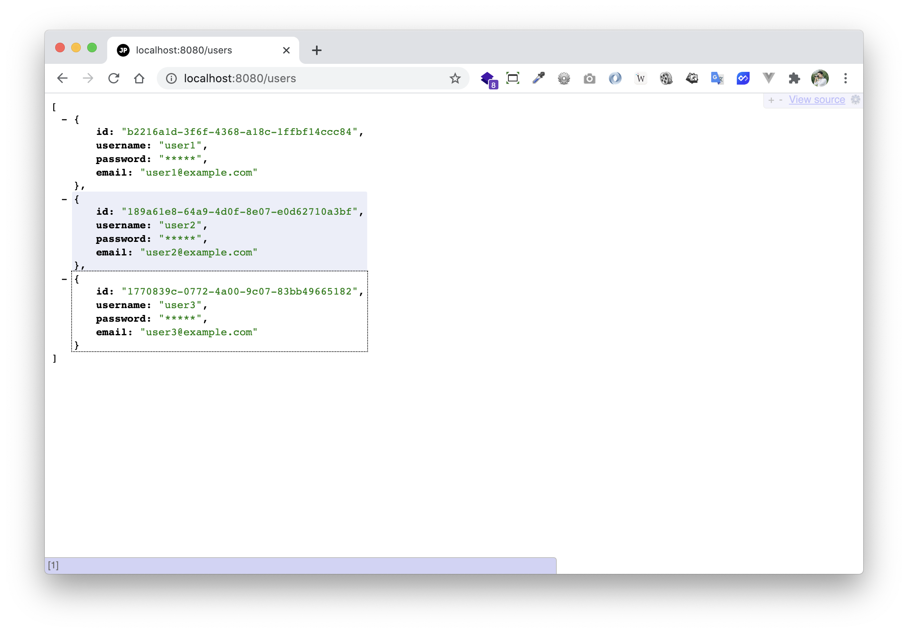
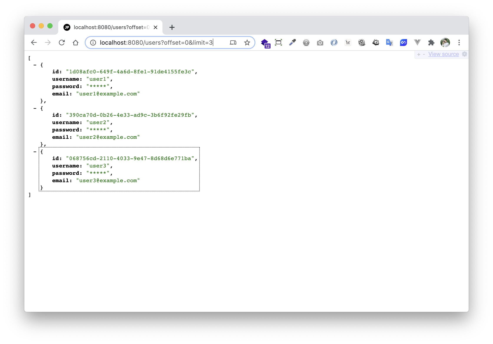

# spring-boot-reactive-pagination

> ตัวอย่างการทำ Pagination สำหรับ Spring-boot Reactive 


# Prerequisites

- การทำ Pagination ในตัวอย่างนี้ ทำเพื่อ Support Spring-data เป็นหลัก ออกแบบเอง โดยยึดการออกแบบตามเอกสารฉบับนี้ [https://developers.pamarin.com/docs/v1/pagination](https://developers.pamarin.com/docs/v1/pagination) แนะนำให้อ่านเอกสารก่อน แล้วจะเข้าใจว่าทำไมถึงเขียน Code แบบนี้ 

# 1. เพิ่ม Dependencies และ Plugins

pom.xml 
``` xml
...
<parent>
    <groupId>org.springframework.boot</groupId>
    <artifactId>spring-boot-starter-parent</artifactId>
    <version>2.3.2.RELEASE</version>
</parent>

<dependencies>
    <dependency>
        <groupId>org.springframework.boot</groupId>
        <artifactId>spring-boot-starter-webflux</artifactId>
    </dependency>
    
    <dependency>
        <groupId>org.projectlombok</groupId>
        <artifactId>lombok</artifactId>
        <scope>provided</scope>
    </dependency>

    <dependency>
        <groupId>org.springframework.data</groupId>
        <artifactId>spring-data-commons</artifactId>
        <version>2.2.6.RELEASE</version>
    </dependency>
</dependencies>

<build>
    <plugins>
        <plugin>
            <groupId>org.springframework.boot</groupId>
            <artifactId>spring-boot-maven-plugin</artifactId>
            <executions>        
                <execution>            
                    <id>build-info</id>            
                    <goals>                
                        <goal>build-info</goal>            
                    </goals>        
                    <configuration>                
                        <additionalProperties>                    
                            <java.version>${java.version}</java.version>                                   
                        </additionalProperties>            
                    </configuration>        
                </execution>    
            </executions>
        </plugin>
    </plugins>
</build>
...
```

**คำอธิบาย**

- `spring-data-commons` เป็น Dependency ที่ใช้สำหรับตัวอย่างนี้เท่านั้น 
- เวลาใช้งานจริง จะใช้ `spring-boot-starter-data` หรือ `spring-boot-starter-data-XXX` แทน เช่น ตัวอย่างนี้ [spring-boot-reactive-r2dbc-postgresql](../spring-boot-reactive-r2dbc-postgresql/) 

# 2. เขียน Main Class 

``` java
@SpringBootApplication
@ComponentScan(basePackages = {"me.jittagornp"})
public class AppStarter {

    public static void main(String[] args) {
        SpringApplication.run(AppStarter.class, args);
    }

}
```

# 3. เขียน Model  

เพื่อไว้รับ Pagination Request 
```java
@Data
@Builder
public class PaginationRequest {

    private long offset = 0;

    private int limit;

    private int page = -1;

    private int size;

    private Sort sort;

    private int defaultLimit = 20;

    private int defaultSize = 20;

    private int maxLimit = 100;

    private int maxSize = 100;

    ...
}
```

# 4. เขียน Converter 

เพื่อเอาไว้ Convert Request ไปใส่ Model ในข้อ 3 

ประกาศ Interface
```java
public interface QueryStringParameterToPaginationRequestConverter {

    PaginationRequest convert(final MultiValueMap<String, String> queryParams);

}
```

Implement Interface
```java

@Slf4j
@Component
public class QueryStringParameterToPaginationRequestConverterImpl implements QueryStringParameterToPaginationRequestConverter {

    private static final int DEFAULT_LIMIT = 20;
    private static final int DEFAULT_SIZE = 20;
    private static final int MAX_LIMIT = 100;
    private static final int MAX_SIZE = 100;

    @Override
    public PaginationRequest convert(final MultiValueMap<String, String> queryParams) {
        final long offset = parseLong(queryParams, "offset", 0L);
        final int limit = parseInt(queryParams, "limit", DEFAULT_LIMIT);
        final int page = parseInt(queryParams, "page", -1);
        final int size = parseInt(queryParams, "size", DEFAULT_SIZE);
        final Sort sort = convertToSort(queryParams.getFirst("sort"));
        return PaginationRequest.builder()
                .offset(offset)
                .limit(limit)
                .page(page)
                .size(size)
                .sort(sort)
                .defaultLimit(DEFAULT_LIMIT)
                .defaultSize(DEFAULT_SIZE)
                .maxLimit(MAX_LIMIT)
                .maxSize(MAX_SIZE)
                .build();
    }

    ...
}
```

# 5. Config Resolver 

เพื่อให้ Spring ใช้ Converter ที่เขียนไว้  
  
โดยเราจะเอา Converter ที่เราเขียนไว้ ไปใช้งานในรูปแบบของ `MethodArgumentResolver` เพื่อให้ Spring ทำการแปลง Http Request Query String ตาม Logic ที่เราเขียนไปใส่เป็น Method Argument ให้

```java
@Slf4j
@Configuration
public class WebConfig implements WebFluxConfigurer {

    @Override
    public void configureArgumentResolvers(final ArgumentResolverConfigurer configurer) {
        configurer.addCustomResolver(new ReactivePaginationRequestMethodArgumentResolver());
    }

    public static class ReactivePaginationRequestMethodArgumentResolver implements HandlerMethodArgumentResolver {

        private final QueryStringParameterToPaginationRequestConverter converter = new QueryStringParameterToPaginationRequestConverterImpl();

        @Override
        public boolean supportsParameter(final MethodParameter methodParameter) {
            return PaginationRequest.class.equals(methodParameter.getParameterType());
        }

        @Override
        public Mono<Object> resolveArgument(
                final MethodParameter methodParameter,
                final BindingContext bindingContext,
                final ServerWebExchange serverWebExchange
        ) {
            return Mono.just(converter.convert(serverWebExchange.getRequest().getQueryParams()));
        }
    }

}
```

# 6. Config Jackson  

เพื่อ Custom Page Response
   
เขียน PageJsonSerializer 
```java
public class PageJsonSerializer extends JsonSerializer<Page> {

    @Override
    public void serialize(
            final Page page,
            final JsonGenerator generator,
            final SerializerProvider serializerProvider
    ) throws IOException {
        generator.writeStartObject();
        generator.writeObjectField("elements", page.getContent());
        generator.writeObjectField("elements_size", page.getNumberOfElements());
        generator.writeObjectField("page", page.getNumber());
        generator.writeObjectField("size", page.getSize());
        generator.writeObjectField("total", page.getTotalPages());
        generator.writeObjectField("total_elements", page.getTotalElements());
        generator.writeObjectField("has_elements", page.hasContent());
        generator.writeObjectField("has_previous", page.hasPrevious());
        generator.writeObjectField("has_next", page.hasNext());
        generator.writeObjectField("is_first", page.isFirst());
        generator.writeObjectField("is_last", page.isLast());
        generator.writeObjectField("first", 0);
        generator.writeObjectField("last", (page.getTotalPages() == 0) ? 0 : (page.getTotalPages() - 1));
        generator.writeEndObject();
    }

}
```

เขียน Jackson Config

```java
@Configuration
public class JacksonConfig implements Jackson2ObjectMapperBuilderCustomizer {

    @Override
    public void customize(final Jackson2ObjectMapperBuilder jacksonObjectMapperBuilder) {
        jacksonObjectMapperBuilder
                .serializerByType(Page.class, new PageJsonSerializer());
    }

}
```

# 7. เขียน Controller
``` java
@Slf4j
@RestController
@RequestMapping("/users")
public class UserController {

    ...   

    @GetMapping
    public Mono findAll(final PaginationRequest paginationRequest) {
        if (paginationRequest.isPageRequest()) {
            final Pageable pageable = paginationRequest.toPage();
            return fakePageFromDatabase(pageable);
        } else {
            final Pageable pageable = paginationRequest.toSlice();
            return fakeSliceFromDatabase(pageable);
        }
    }

    private Mono<Page<User>> fakePageFromDatabase(final Pageable pageable) {
        log.debug("Page *************************************");
        log.debug("offset => {}", pageable.getOffset());
        log.debug("limit => {}", pageable.getPageSize());
        log.debug("query from database ....");
        return Mono.just(new PageImpl<>(
                fakeUsers,
                pageable,
                fakeTotalElements
        ));
    }

    private Mono<List<User>> fakeSliceFromDatabase(final Pageable pageable) {
        log.debug("Slice *************************************");
        log.debug("offset => {}", pageable.getOffset());
        log.debug("limit => {}", pageable.getPageSize());
        log.debug("query from database ....");
        return Mono.just(fakeUsers);
    }

}
```

### คำอธิบาย 

- เมื่อเราเรียก API ด้วย GET `http://localhost:8080/users?offset=0&limit=3` Spring จะทำการแปลง Request Query String ไปเป็น Java Object `PaginationRequest` ให้โดยอัตโนมัติ ตาม Logic ที่เราเขียนไว้ 
- จากนั้น เราต้องตัดสินใจเองด้วย `paginationRequest.isPageRequest()` ว่า ถ้า Request ที่เข้ามาเป็นแบบ Slice หรือแบบ Page จะให้ทำยังไงต่อ 
- ซึ่งในความเป็นจริง จะเป็นการนำค่าที่ได้ไป Query ข้อมูลจาก Database ต่อ  
- แล้วก็ Response กลับไปตามรูปแบบ (Slice หรือ Page) ที่กำหนด 


# 8. Build Code
cd ไปที่ root ของ project จากนั้น  
``` shell 
$ mvn clean package
```

# 9. Run 
``` shell 
$ mvn spring-boot:run
```

# 10. เข้าใช้งาน

เปิด browser หรือ Postman แล้วเข้า 

### Slice

- [http://localhost:8080/users](http://localhost:8080/users)



- [http://localhost:8080/users?offset=0&limit=3](http://localhost:8080/users?offset=0&limit=3)



### Page

- [http://localhost:8080/users?page=1&size=3](http://localhost:8080/users?page=1&size=3)


สังเกตว่า API นี้สามารถ Response ได้เป็น 2 แบบ ทั้งแบบ Slice และแบบ Page ตามเอกสารที่ออกแบบไว้
