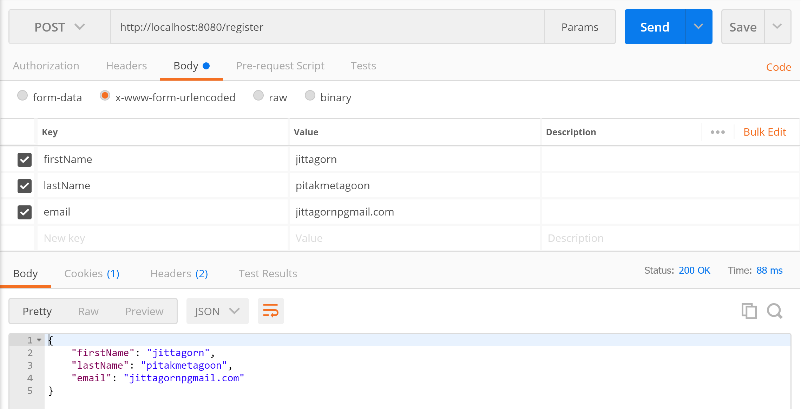

# spring-boot-webflux-form-data
ตัวอย่างการเขียน Spring-boot WebFlux Form Data 

# 1. เพิ่ม Dependencies

pom.xml 
``` xml
...
<parent>
    <groupId>org.springframework.boot</groupId>
    <artifactId>spring-boot-starter-parent</artifactId>
    <version>2.1.5.RELEASE</version>
</parent>

<dependencies>
    <dependency>
        <groupId>org.springframework.boot</groupId>
        <artifactId>spring-boot-starter-webflux</artifactId>
    </dependency>
    
    <dependency>
        <groupId>org.projectlombok</groupId>
        <artifactId>lombok</artifactId>
        <scope>provided</scope>
    </dependency>
</dependencies>

...
```

หมายเหตุ lombox เป็น annotation code generator ตัวนึงครับ  

# 2. เขียน Main Class 

``` java
@SpringBootApplication
@ComponentScan(basePackages = {"com.pamarin"}) 
public class AppStarter {

    public static void main(String[] args) {
        SpringApplication.run(AppStarter.class, args);
    }

}
```

# 3. เขียน Model หรือ DTO
```java
@Getter
@Setter
public class RegisterForm {

    private String firstName;

    private String lastName;

    private String email;
}
```

# 4. เขียน Controller
``` java
@Slf4j
@RestController
public class RegisterFormController {
    
    @GetMapping({"", "/"})
    public Mono<String> hello() {
        return Mono.just("Hello world.");
    }

    @PostMapping("/register")
    public Mono<RegisterForm> register(RegisterForm form) {
        return Mono.just(form);
    }
}
```

# 5. Build
cd ไปที่ root ของ project จากนั้น  
``` shell 
$ mvn clean install
```

# 6. Run 
``` shell 
$ mvn spring-boot:run
```

# 7. เข้าใช้งาน

เปิด browser แล้วเข้า [http://localhost:8080](http://localhost:8080)

# ทดสอบ

 ลองยิง postman POST ไปยัง `/register` ดังนี้ 
 
 
